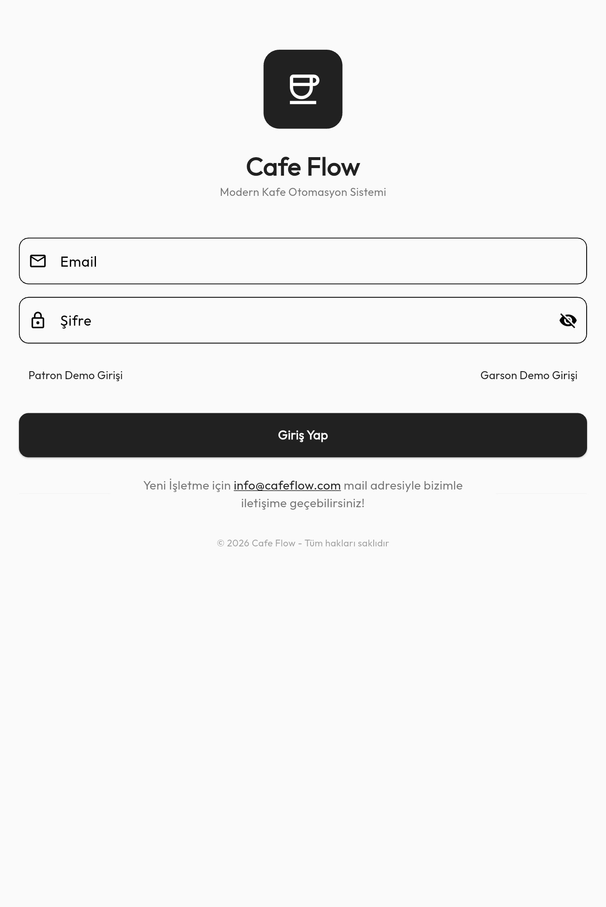
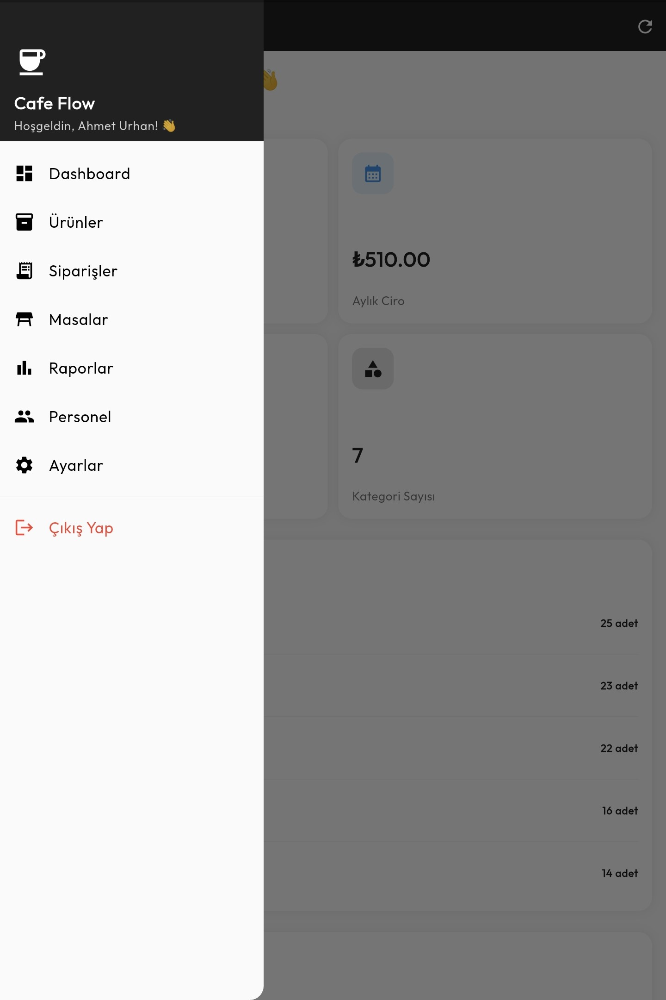
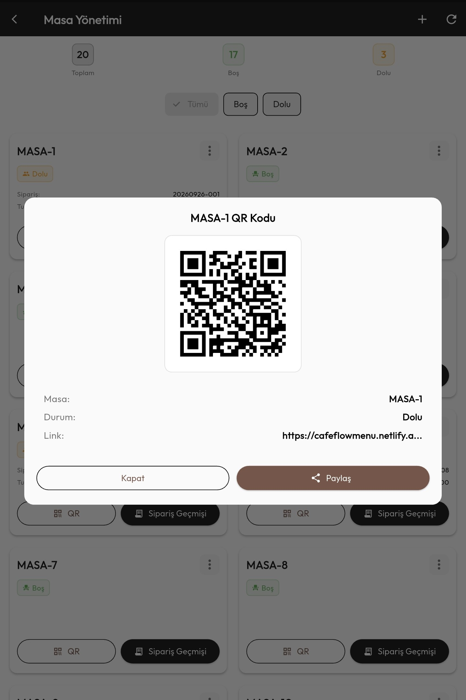
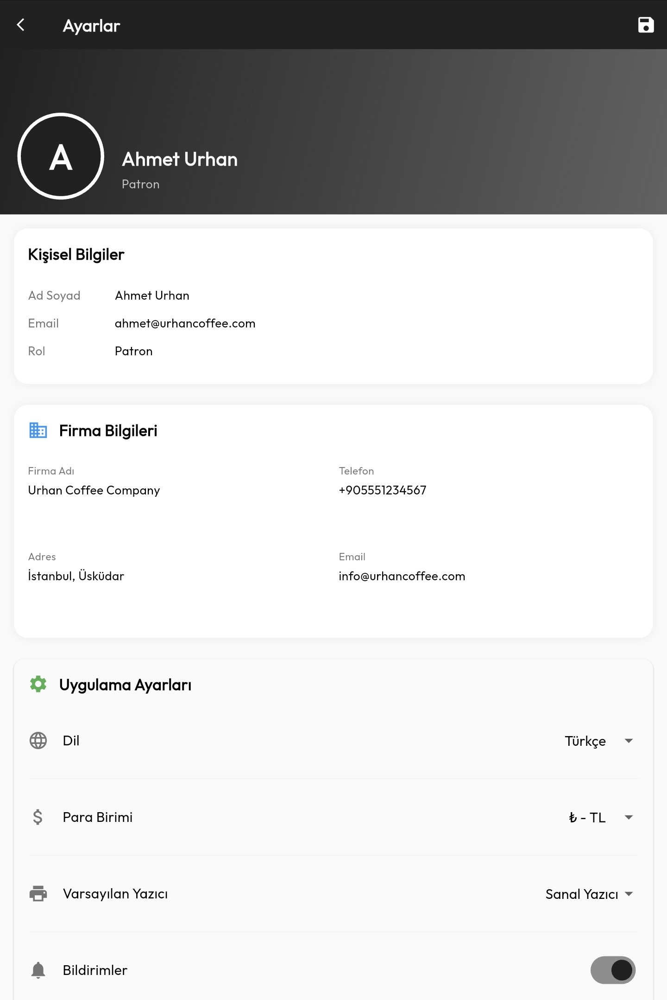
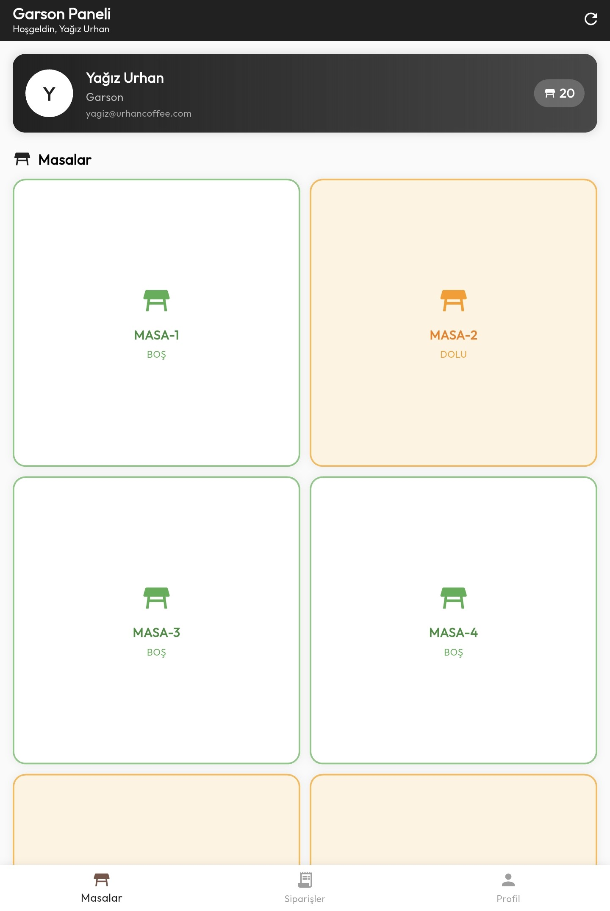
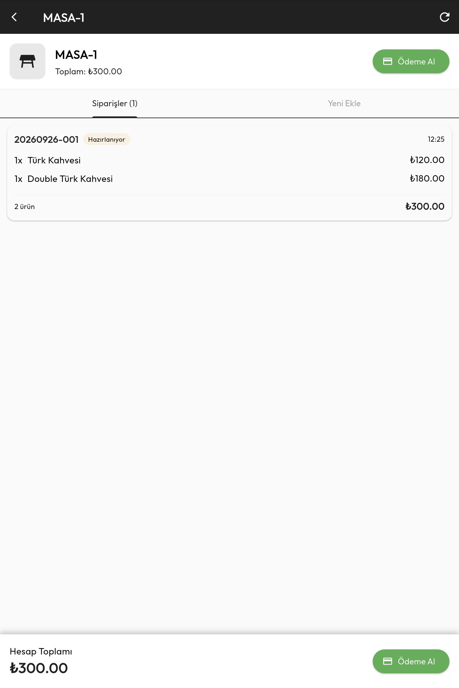
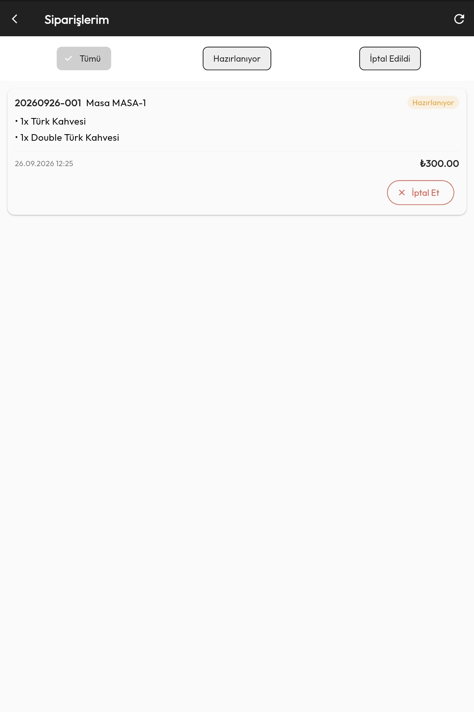
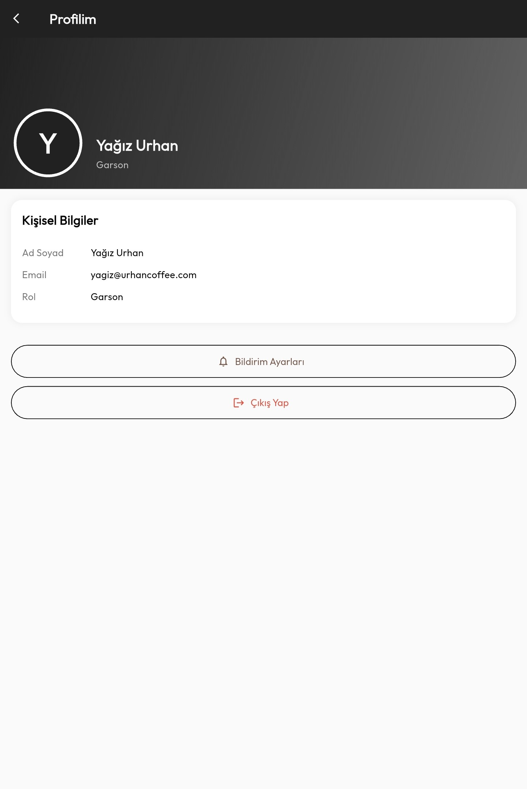

# CafeFlow

**Full-Stack Restoran Yönetim Platformu**

CafeFlow; restoranların masa, sipariş, stok, kullanıcı ve müşteri menüsü gibi operasyonlarını yönetmek amacıyla geliştirilmiş full-stack bir restoran yönetim uygulamasıdır.

Proje; **Java, Spring Boot, PostgreSQL ve Flutter** kullanılarak, REST API tabanlı bir backend mimarisiyle geliştirilmiştir.

## Kullanılan Teknolojiler

### Backend

* Java
* Spring Boot
* Spring Security
* REST API
* JPA / Hibernate
* JWT

### Veritabanı

* PostgreSQL

### Mobil

* Flutter
* Dart

### Geliştirme

* Git
* GitHub
* OOP
* MVC
* Rol Bazlı Yetkilendirme

## Özellikler

* JWT ile kullanıcı kimlik doğrulama
* Rol bazlı yetkilendirme
* Owner ve Waiter kullanıcı rolleri
* Restoran masa yönetimi
* Sipariş yönetimi
* Stok yönetimi
* QR kod ile müşteri menüsü
* Raporlama
* Bildirimler
* Backend ve mobil uygulama arasında REST API iletişimi

## Uygulama Yapısı

### Backend

Backend, **Java ve Spring Boot** kullanılarak geliştirilmiştir ve uygulamanın iş mantığı ile veri yönetimi için REST API endpoint'leri sağlamaktadır.

Kimlik doğrulama ve yetkilendirme işlemleri için **Spring Security ve JWT** kullanılmaktadır.

### Veritabanı

İlişkisel veritabanı olarak **PostgreSQL** kullanılmaktadır.

Backend ile veritabanı arasındaki iletişim **JPA / Hibernate** üzerinden sağlanmaktadır.

### Mobil Uygulama

Mobil uygulama **Flutter ve Dart** kullanılarak geliştirilmiştir.

Kullanıcının rolüne göre farklı uygulama akışları ve erişim yetkileri sunulmaktadır.

## Kullanıcı Rolleri

### Owner

* Restoran yönetimi
* Masa yönetimi
* Stok yönetimi
* Raporlama
* Kullanıcı işlemleri

### Waiter

* Masa işlemleri
* Sipariş yönetimi
* Restoran operasyon süreçleri

### Customer

* QR kod üzerinden restoran menüsüne erişim

## Deployment

Backend bir **cloud ortamına deploy edilmiş** ve Flutter mobil uygulaması ile REST API üzerinden iletişim sağlayacak şekilde yapılandırılmıştır.

## Proje Ekran Görüntüleri
## Proje Ekran Görüntüleri

  <b>Giriş Ekranı</b> 
  

  <b>Owner Paneli</b> 
  
  

  
  

  <b>Ürün Yönetimi</b> &nbsp;&nbsp;&nbsp; <b>Sipariş Yönetimi</b> 
  
  

  <b>Masa Yönetimi</b> 
  
  
  

  <b>Raporlar ve Analitik</b> 
  
  

  
  

  <b>Personel Yönetimi</b> &nbsp;&nbsp;&nbsp; <b>Ayarlar</b> 
  
  

  <b>Waiter Paneli</b> 
  

  <b>Masa Sipariş Bilgisi</b> &nbsp;&nbsp;&nbsp; <b>Masa Ödeme Al & Masa Kapat</b> 
  
  

  <b>Yeni Sipariş Ekle</b> 
  
  

  <b>Siparişler</b> &nbsp;&nbsp;&nbsp; <b>Ayarlar</b> 
  
  

  <b>Müşteri Qr Sipariş Menü</b> 
  
  
  

## Proje Durumu

Bu proje; backend geliştirme, mobil uygulama geliştirme, veritabanı yönetimi, kimlik doğrulama, yetkilendirme ve cloud deployment konularında pratik deneyim kazanmak amacıyla geliştirilmiş kapsamlı bir full-stack uygulamadır.
